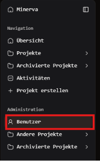
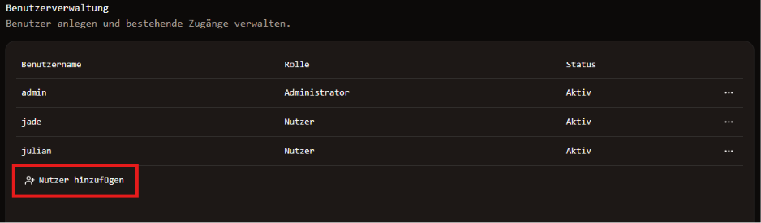
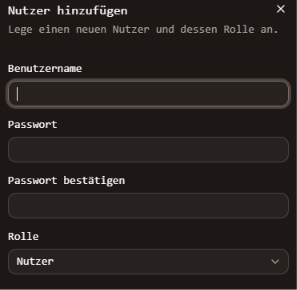
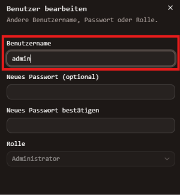
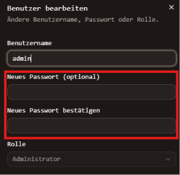
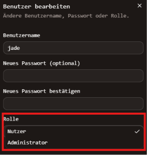

# Nutzerübersicht
Als Admin kann die Benutzerübersicht in der linken Navigationsleiste unter
"Benutzer" gefunden werden.

## Nutzer hinzufügen
Um einen neuen Nutzer anzulegen, wird der entsprechende Button unterhalb der 
vorhandenen Nutzer ausgewählt.

Daraufhin öffnet sich am rechten Rand des Fensters ein Popup. Hier müssen
Name, Passwort und Rolle des neuen Nutzers angegeben werden.

## Nutzer bearbeiten
Um einen Nutzer zu bearbeiten kann der entsprechende Nutzer via Rechtsklick 
oder indem die drei Punkte an der rechten Seite der entsprechenden Zeile angeklickt 
und anschließend "Nutzer bearbeiten" ausgewählt werden.

### Nutzername Ändern
Ein Admin kann den Nutzernamen von einem Nutzer, sich selbst oder einem
anderen Admin ändern,indem er in der linken Navigationsleiste unter 
"Administration" "Benutzer" auswählt (siehe "Nutzerübersicht"). Dort kann 
der entsprechende Nutzer via Rechtsklick oder indem die drei Punkte am rechten 
Ende der entsprechenden Zeile angeklickt und anschließend "Nutzer bearbeiten" 
ausgewählt wird.

### Passwort Ändern
Ein Admin kann das Passwort von einem Nutzer, sich selbst oder einem
anderen Admin ändern, indem er in der linken Navigationsleiste unter 
"Administration" "Benutzer" auswählt (siehe "Nutzerübersicht"). Dort kann 
der entsprechende Nutzer via Rechtsklick oder indem die drei Punkte am rechten 
Ende der entsprechenden Zeile angeklickt und anschließend "Nutzer bearbeiten" 
ausgewählt wird.

### Rolle Ändern
Ein Admin kann die Rolle von einem Nutzer ändern, indem er in der linken 
Navigationsleiste unter "Administration" "Benutzer" auswählt (siehe "Nutzerübersicht"). 
Dort kann der entsprechende Nutzer via Rechtsklick oder indem die drei Punkte 
am rechten Ende der entsprechenden Zeile angeklickt und anschließend "Nutzer bearbeiten" 
ausgewählt wird.

