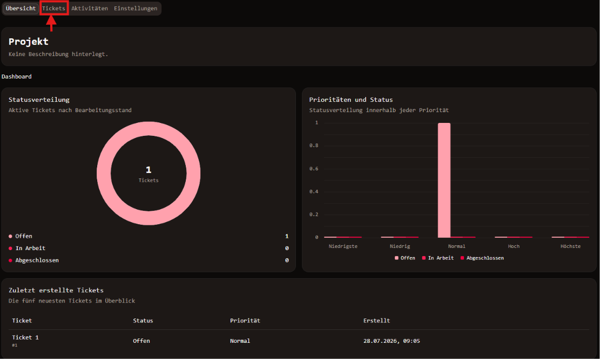
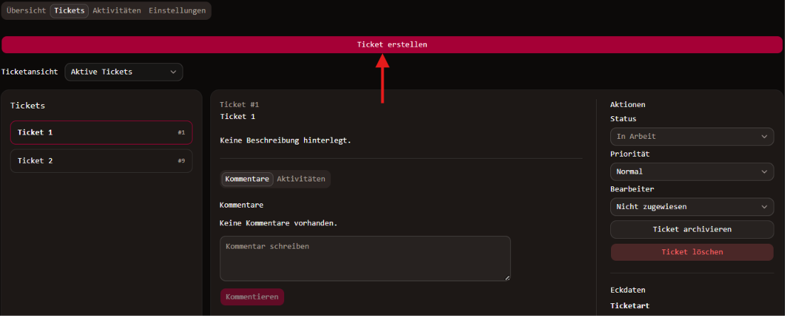
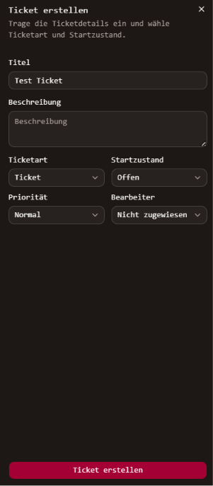

# Ticket anlegen
Wenn ein Projekt ausgewählt ist, kann die Ticketübersicht unter "Tickets",
in der Navigationsleiste oben links, gefunden werden.

Bei der Ticketübersicht findet sich der Button zur Erstellung eines neuen
Tickets.

Wurde der Button betätigt, erscheint das folgende Feld am rechten Rand des 
Fensters. Dort werden die Angaben zum Titel, zur Ticketart, zur Priorität, 
zum Bearbeiter und zu dem Zustand des Tickets bei Erstellung gemacht. Wie
bei der Projekterstellung ist die Angabe einer Beschreibung optional.

Wenn alle Felder entsprechend ausgefüllt sind, unten "Ticket erstellen"
auswählen.